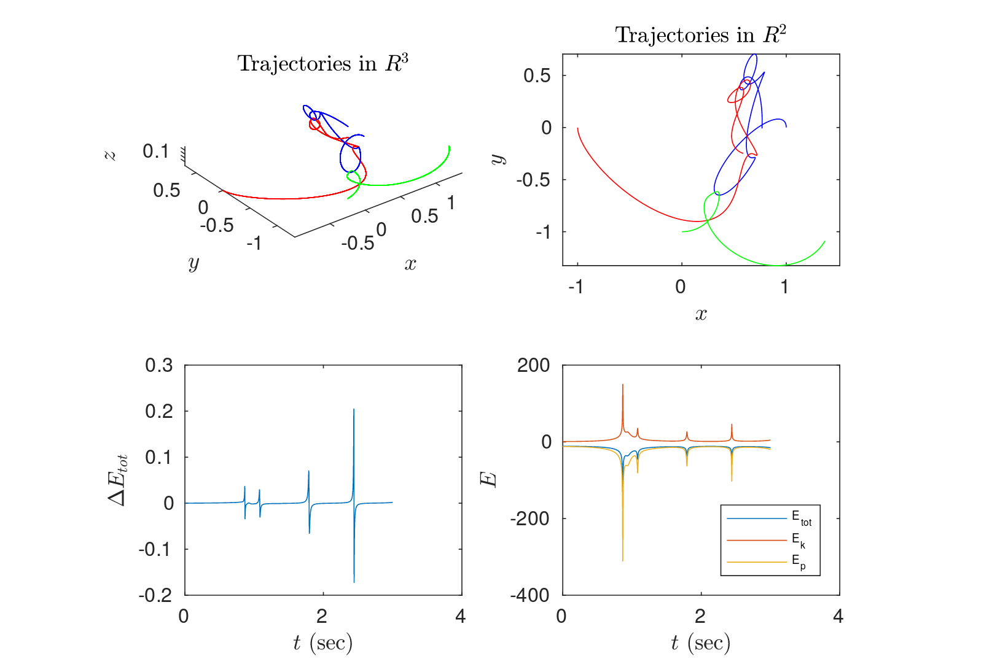

# n-body-gravity

N-body gravity simulation with adaptive multilevel time stepping. Integrators implemented 'Euler', 'DKD', 'KDK' and 'RK4'.

Computational Astrophysics Course Project, ETH Zurich, 2012

mikael.mieskolainen@cern.ch
